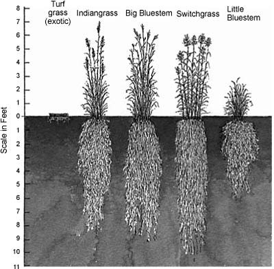

```{r setup, include=FALSE}
knitr::opts_chunk$set(echo = FALSE)
library(dplyr)
library(readr)
library(tidyverse)
library(googlesheets4)
gs4_deauth()


#read in proportion data
np_url <- "https://docs.google.com/spreadsheets/d/1hfK3ptAkMU4AiM5PknHe4IebFl29wEWNdMKpc5nEC4M/edit#gid=0"
np_data <-
  read_sheet(np_url) %>% 
  left_join(read_sheet(np_url, sheet = 2)) %>% 
  print()

houston_url <- "https://docs.google.com/spreadsheets/d/1-VpDe1FBQKK1nWYI_HOV8qVGD1fSHKUoe65E11iqOEU/edit#gid=1776011343"

houston_data <-
  read_sheet(houston_url) %>% 
  left_join(read_sheet(houston_url, sheet = 2)) %>% 
  print()

#year 2020 data
NP_Species_20 <- read_sheet("https://docs.google.com/spreadsheets/d/1rVNHuyM9z6qAGKWknkn8j7zuJhFyHJeZnLgxxVdpM-4/edit#gid=0")
NP_Species_20


Houston_Species_20 <- read_sheet("https://docs.google.com/spreadsheets/d/1E4_RjXlmtJN9BJ0-z-cDE3Mzdpym_Bl0bLrklUKAsu8/edit#gid=0")

#year 2018 data
NP_Species_18 <- read_sheet("https://docs.google.com/spreadsheets/d/1bBaDxI7PnZIbDDT4N_kmLap8wHPJO6cyj4Qaxv3xwvI/edit#gid=0")
NP_Species_18

houston_url <-"https://docs.google.com/spreadsheets/d/1dE-9shHj4D0H8DHCF25JeJpycBEBOA5x38j4uQILnJs/edit#gid=0"

Houston_Species_18 <- 
read_sheet(houston_url, sheet = "data")

#2021 data
NP_Species <- read_sheet("https://docs.google.com/spreadsheets/d/1hfK3ptAkMU4AiM5PknHe4IebFl29wEWNdMKpc5nEC4M/edit#gid=0")
NP_Species

Houston_Species <- read_sheet("1-VpDe1FBQKK1nWYI_HOV8qVGD1fSHKUoe65E11iqOEU")

```

# 

# **How does species richness vary in native restored prairies when NPK fertilizer treatments are applied**

Gabriella Ruiz, Chani Thorne

Department, Minnesota State University Moorhead, 1104 7th Avenue South, Moorhead, MN  56563

### Abstract 

The Minnesota State University of Moorhead Regional Science Center has two established restored prairie sites: North Pond and Houston. Students at MSUM have collected 5 years of percent cover data from North Pond and 3 years from Houston. We will be using these data sets to ask "How does species richness vary in native restored prairies when NPK fertilizer treatments are applied?" We will be using exploratory data analysis to pursue this question by comparing percent cover and taxa data from both sites to look at the variation of species richness. Previous studies on native and restored prairies have shown that anthropogenic influences on the environment fuel the growth of invasive species (MacDougall et al. 2014). We expect to find that plots with applied NPK fertilizer will have a lower overall species richness than plots with no nutrients applied. A greater understanding of these processes and consequent environmental impacts may provide a useful background of knowledge for land management, restoration, and conservational efforts.

### **Methods**

According to NutNet protocols (Nutrient Network 2016), each NutNet site is split into three blocks, each with 10 5x5 m plots for a total of 30 plots. Factorial combinations of nutrients (Nitrogen, Phosphorus, and Potassium - NPK) were added for the fifth year to designated 5x5 m plots in the spring. The Houston site follows the same protocols for 5x5 m plot design as well, but does not receive the fertilizer treatment. We measured species diversity and species abundance using NutNet protocols for both sites (Nutrient Network 2016):

-   Percent cover of each plant species was recorded within a 1-2 m subplot in each plot at both sites as a measure of species diversity and abundance

Data analysis was completed using R Studio software. 


### **Results**

```{r}

data <-
  bind_rows(
    NP_Species_18, 
    Houston_Species_18
  ) %>% 
  mutate(
    plot = factor(plot)
  )

data_presence_site <- 
  data %>% 
  distinct(site, taxa) %>% 
  mutate(present = TRUE) %>% 
  pivot_wider(
    names_from = "site", 
    values_from = "present", 
    values_fill = FALSE
  )  

#FOR POSTER
data %>% 
  count(site, plot, treatment, name = "n_spp") %>% 
  ggplot() +
  geom_col (size = 3) + (mapping = aes(x = plot, y = n_spp, fill = treatment)) +
  facet_wrap(~ site)

```

###### Fig. 1 Proportions of native versus nonnative species richness at North Pond and Houston in 2021.

```{r}

data <-
  bind_rows(
    NP_Species, 
    Houston_Species
  ) %>% 
  mutate(
    plot = factor(plot)
  )

data_presence_site <- 
  data %>% 
  distinct(site, taxa) %>% 
  mutate(present = TRUE) %>% 
  pivot_wider(
    names_from = "site", 
    values_from = "present", 
    values_fill = FALSE
  )

data %>% 
  count(site, plot, treatment, name = "n_spp") %>% 
  ggplot() +
  geom_col(mapping = aes(x = plot, y = n_spp, fill = treatment)) +
  facet_wrap(~ site)
```

###### Fig. 2 Comparison of plant species richness between untreated plots, Houston (left) and NPK treated plots, North Pond (right). 2021

```{r}

data <-
  bind_rows(
    NP_Species_20, 
    Houston_Species_20
  ) %>% 
  mutate(
    plot = factor(plot)
  )

data_presence_site <- 
  data %>% 
  distinct(site, taxa) %>% 
  mutate(present = TRUE) %>% 
  pivot_wider(
    names_from = "site", 
    values_from = "present", 
    values_fill = FALSE
  ) 

#FOR POSTER
data %>% 
  count(site, plot, treatment, name = "n_spp") %>% 
  ggplot() +
  geom_col (size = 3) + (mapping = aes(x = plot, y = n_spp, fill = treatment)) +
  facet_wrap(~ site)
```

###### Fig. 3 Comparison of plant species richness between untreated plots, Houston (left) and NPK treated plots, North Pond (right). 2020 data

Figures 1-3 depict the species richness distribution between plots at North Pond and Houston. These graphs show a couple of visual trends over the years. In recent summers, it appears that control plots at North Pond have been supporting more species, whereas control plots at Houston have had fewer. This may be caused by a multitude of reasons, such as fertilizer impacting the ability for native species to grow at NP or changes in prairie management such as controlled burnings. These results do not necessarily suggest that the overall health of the prairie has declined, however. These first three graphs do not take into consideration the native versus nonnative status. There is the possibility that the decrease in species richness at Houston has been the decline of invasive species, although further analyses is needed to determine this.  

```{r}

#manipulate rows
data <-
  bind_rows(
    np_data, 
    houston_data
  ) %>% 
  mutate(
    plot = factor(plot)
  )


data_presence_site <- 
  data %>% 
  distinct(site, status) %>% 
  mutate(present = TRUE) %>% 
  pivot_wider(
    names_from = "site", 
    values_from = "present", 
    values_fill = FALSE
  ) 

data %>% 
  count(site, plot, status, name = "n_spp") %>% 
  group_by(site) %>% 
  mutate(n_site = sum(n_spp), p = n_spp/n_site) %>% 
  group_by(status, site) %>% 
  summarise(sum_p = sum(p)) %>% 
  ggplot() +
  geom_col(mapping = aes(x = site, y = sum_p, fill = status),
           position = "stack")
```

###### Fig. 4 Comparison of plant species richness between untreated plots, Houston (left) and NPK treated plots, North Pond (right). 2018 data

Figure 4 shows the proportions of native and nonnative species that were present per plot in the summer of 2021 at both sites. A Chi-Squared test with the data; X-squared = 0.37645, df = 1, p-value = 0.5395, concluded that the results were not significant. However, this test, similarly to the first three, does not consider biomass or percent cover. This means that if a plot has 4 invasive species and 2 native species, the plot will be determined to have more invasive species. But when we look at biomass and percent cover, we may discover that that a majority of the plot is dominated by individual native species (say 80%).

###  
**Discussion**

Nutrient deposition and runoff often contaminate the surrounding area of application. A study completed on the effects of urbanization on species richness showed that under circumstances of urbanization, species richness almost always decreases (McKinney 2008). This, paired with our results that have shown a higher average species richness in control plots as compared to plots with NPK additives, could implicate that as urban growth and sprawl increase, we will see a decrease of native species richness as more land is maintained with chemical control including fertilizers, herbicides, and pesticides. There is also evidence that suggests that the use of NPK fertilizers could increase the amount of exotic species richness, thus decreasisng the number of native species richness in prairie landscapes (Seableem 2013).

This result is often misinterpreted, as fertilizers have a tendency to increase biomass. This creates the illusion that there is a healthy environment because there is more plant matter, but an analysis of species richness will often times reveal that, as we have seen in our work at the MSUM RSC, chemicals decrease species richness. 

######  

###### Fig. 5 Example of above ground biomass taken from Nat'l Bobwhite Conservation Initiative. (2016)

### **Sources**

### 

Nutrient Network: A Global Research Cooperative. 2016. Retrieved from <http://www.nutnet.org/exp_protocol>.

MacDougall AS, Bennett JR, Firn J, et al. 2014. Anthropogenic-based regional-scale factors most consistently explain plot-level exotic diversity in grasslands. Global Ecology and Biogeography. 23(7):802–810. doi:10.1111/geb.12157.

McKinney ML. 2008. Effects of urbanization on species richness: A review of plants and animals. Urban Ecosystems. 11(2):161–176. doi:10.1007/s11252-007-0045-4.

  
Seabloom, Eric W., et al. "Predicting Invasion in Grassland Ecosystems: Is Exotic Dominance the Real Embarrassment of Richness?" Global Change Biology, vol. 19, no. 12, 2013, pp. 3677–3687., <https://doi.org/10.1111/gcb.12370.>

### **Acknowledgements**

Field work was funded by a MSUM Strong Summer Scholars grant awarded to Tyler Edvall, Gabriella Ruiz, Jake Pundsack, Jwan Al Selim, and Katie Olson in 2021. Assistance was provided by Elise Bakke and Dr. Alison Wallace.

  
