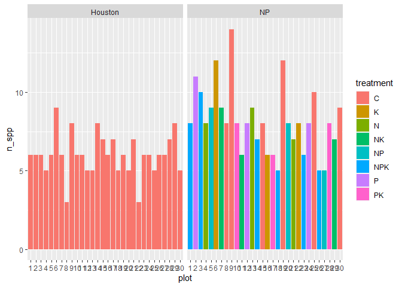

#Title

Author

Affiliations

## GitHub Documents

This is an R Markdown format used for publishing markdown documents to
GitHub. When you click the **Knit** button all R code chunks are run and
a markdown file (.md) suitable for publishing to GitHub is generated.

## Including Code

You can include R code in the document as follows:

    ##      speed           dist       
    ##  Min.   : 4.0   Min.   :  2.00  
    ##  1st Qu.:12.0   1st Qu.: 26.00  
    ##  Median :15.0   Median : 36.00  
    ##  Mean   :15.4   Mean   : 42.98  
    ##  3rd Qu.:19.0   3rd Qu.: 56.00  
    ##  Max.   :25.0   Max.   :120.00

## Including Plots

You can also embed plots, for example:

<!-- -->

Note that the `echo = FALSE` parameter was added to the code chunk to
prevent printing of the R code that generated the plot.

    ## 
    ## Attaching package: 'dplyr'

    ## The following objects are masked from 'package:stats':
    ## 
    ##     filter, lag

    ## The following objects are masked from 'package:base':
    ## 
    ##     intersect, setdiff, setequal, union

    ## -- Attaching packages --------------------------------------- tidyverse 1.3.1 --

    ## v ggplot2 3.3.5     v purrr   0.3.4
    ## v tibble  3.1.6     v stringr 1.4.0
    ## v tidyr   1.2.0     v forcats 0.5.1

    ## -- Conflicts ------------------------------------------ tidyverse_conflicts() --
    ## x dplyr::filter() masks stats::filter()
    ## x dplyr::lag()    masks stats::lag()

    ## ! Using an auto-discovered, cached token.

    ##   To suppress this message, modify your code or options to clearly consent to
    ##   the use of a cached token.

    ##   See gargle's "Non-interactive auth" vignette for more details:

    ##   <https://gargle.r-lib.org/articles/non-interactive-auth.html>

    ## i The googlesheets4 package is using a cached token for
    ##   'gabriellanruiz2@gmail.com'.

    ## v Reading from "Copy of NP % Cover 2021".

    ## v Range 'data'.

    ## v Reading from "Copy of NP % Cover 2021".

    ## v Range ''specie status''.

    ## Joining, by = "taxa"

    ## # A tibble: 245 x 6
    ##    site   plot treatment taxa                   cover status   
    ##    <chr> <dbl> <chr>     <chr>                  <dbl> <chr>    
    ##  1 NP        1 NPK       Andropogon_gerardii        1 Native   
    ##  2 NP        1 NPK       Bromus_inermis             1 Nonnative
    ##  3 NP        1 NPK       Galium_boreale             2 Native   
    ##  4 NP        1 NPK       Helianthus_pauciflorus     1 Native   
    ##  5 NP        1 NPK       Poa_compressa              5 Nonnative
    ##  6 NP        1 NPK       Solidago_canadensis       15 Native   
    ##  7 NP        1 NPK       Solidago_gigantea          1 Native   
    ##  8 NP        1 NPK       Sorghastrum_nutans         1 Native   
    ##  9 NP        2 P         Andropogon_gerardii       20 Native   
    ## 10 NP        2 P         Dalea_candida              3 Native   
    ## # ... with 235 more rows

    ## v Reading from "Copy of Houston % Cover 2021".
    ## v Range 'data'.
    ## v Reading from "Copy of Houston % Cover 2021".
    ## v Range ''specie status''.
    ## Joining, by = "taxa"

    ## # A tibble: 180 x 6
    ##    site    treatment  plot taxa                       cover status   
    ##    <chr>   <chr>     <dbl> <chr>                      <dbl> <chr>    
    ##  1 Houston C             1 Bouteloua_curtipendula        10 Native   
    ##  2 Houston C             1 Dichanthelium_oligosanthes     3 Native   
    ##  3 Houston C             1 Poa_pratensis                 15 Nonnative
    ##  4 Houston C             1 Rudbeckia_hirta                5 Native   
    ##  5 Houston C             1 Schizachyrium_scoparium       15 Native   
    ##  6 Houston C             1 Symphyotrichum_ericoides       1 Native   
    ##  7 Houston C             2 Bouteloua_curtipendula         5 Native   
    ##  8 Houston C             2 Bromus_inermis                 2 Nonnative
    ##  9 Houston C             2 Poa_pratensis                  8 Nonnative
    ## 10 Houston C             2 Schizachyrium_scoparium       35 Native   
    ## # ... with 170 more rows

    ## # A tibble: 2 x 3
    ##   status    NP    Houston
    ##   <chr>     <lgl> <lgl>  
    ## 1 Native    TRUE  TRUE   
    ## 2 Nonnative TRUE  TRUE

    ## # A tibble: 0 x 3
    ## # ... with 3 variables: status <chr>, NP <lgl>, Houston <lgl>

    ## `summarise()` has grouped output by 'status'. You can override using the
    ## `.groups` argument.

<!-- -->
